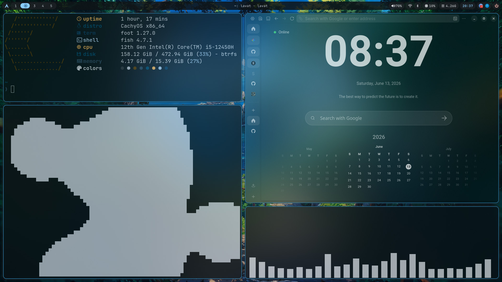
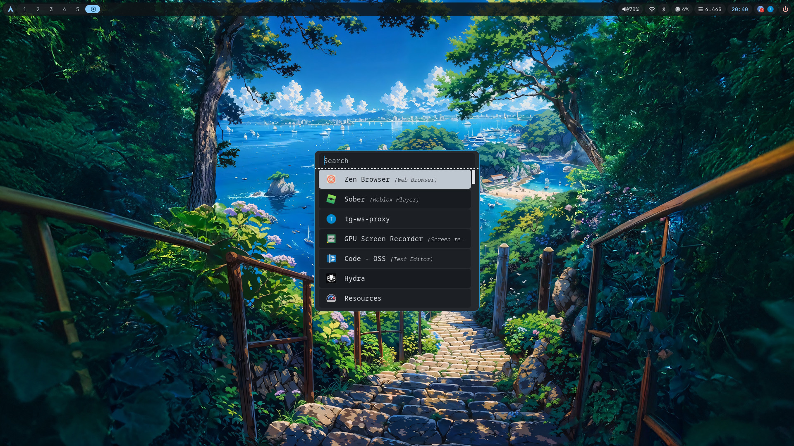
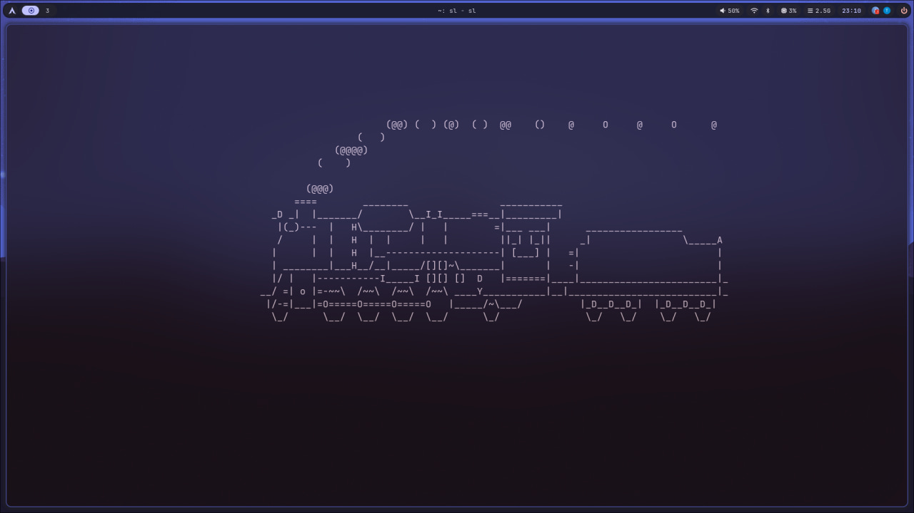
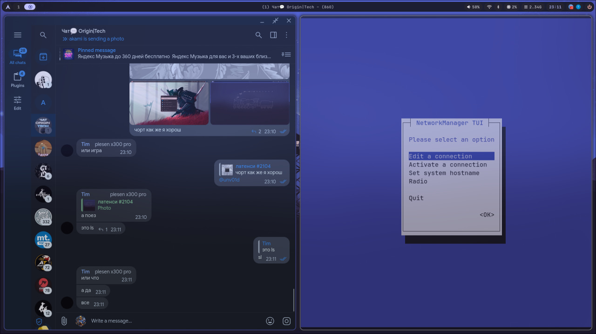

# hyprland-dotfiles

> Built on [CachyOS](https://cachyos.org) — works on any **Arch-based** distribution.

Material You themed Hyprland dotfiles that automatically adapt to your wallpaper via [matugen](https://github.com/InioX/matugen).

## Showcase

<p align="center">
  <video src="https://github.com/latency-tech/hyprland-dotfiles/raw/main/assets/showcase.mov" controls width="720"></video>
</p>

| | |
|---|---|
|  |  |
|  |  |

## Features

- **Auto-theming from wallpaper** — pick any wallpaper and colors are generated instantly using Google's Material You engine. Every component adapts: borders, bar, notifications, launcher, terminal, clipboard, powermenu. No manual color tweaking.
- **Translucent UI** — 25% opacity on windows with built-in Hyprland blur (5 passes) for a smooth glass effect.
- **Rounded corners** — 10px rounding consistently across windows, notifications, bar modules, launcher, and powermenu.
- **Minimal status bar** — Waybar with workspaces, volume, network, bluetooth, CPU, memory, clock, system tray, and a power button. Clean, no clutter.
- **Notification center** — Swaync in notification-list mode, right-aligned, with Material You colors and rounded translucent style.
- **Clipboard management** — Cliphist watches both text and image clipboard via `wl-paste`; Clipman provides a launcher UI bound to `SUPER+V`.
- **Screenshot workflow** — `SUPER+SHIFT+S` captures a selected region with grim+slurp and pipes it straight `wl-copy` — instant paste-ready.
- **Volume & brightness OSD** — Swayosd-client for clean on-screen indicators with `XF86Audio` and `XF86MonBrightness` keys.
- **Wallpaper transitions** — Awww-daemon provides smooth crossfade animations when switching wallpapers.
- **Lockscreen** — Hyprlock with a blurred screenshot background and centered clock + password input.
- **Powermenu** — Wlogout with lock, logout, suspend, reboot, and shutdown buttons, styled consistently.
- **JetBrainsMono Nerd Font** throughout — terminal, bar, launcher, lockscreen, buttons.

## Dependencies

### Core

| Package | Description |
|---|---|
| [Hyprland](https://hyprland.org) | Window manager |
| [waybar](https://github.com/Alexays/Waybar) | Status bar |
| [swaync](https://github.com/ErikReider/SwayNotificationCenter) | Notification center |
| [rofi](https://github.com/davatorium/rofi) | Application launcher |
| [wlogout](https://github.com/ArtsyMacaw/wlogout) | Powermenu |
| [foot](https://codeberg.org/dnkl/foot) | Terminal emulator |
| [fish](https://fishshell.com) | Shell (with [pure](https://github.com/pure-fish/pure) prompt) |
| [yazi](https://yazi-rs.github.io) | File manager |
| [fastfetch](https://github.com/fastfetch-cli/fastfetch) | System info |
| [clipman](https://github.com/chmouel/clipman) | Clipboard manager |

### Theming

| Package | Description |
|---|---|
| [matugen](https://github.com/InioX/matugen) | Material You color generator |
| [matuwall](https://github.com/InioX/matuwall) | Wallpaper picker with auto color generation |

### Utilities

| Package | Description |
|---|---|
| cliphist | Clipboard history |
| grim / slurp | Screenshots |
| wl-clipboard | Clipboard (wl-paste, wl-copy) |
| swayosd-server / swayosd-client | On-screen display (volume, brightness) |
| brightnessctl | Brightness control |
| awww-daemon | Wallpaper transition animations |
| papirus-icon-theme | Icons for rofi |

### Fonts

- [JetBrainsMono Nerd Font](https://www.nerdfonts.com/font-downloads)
- Inter

## Keybindings

| Key | Action |
|---|---|
| `SUPER` + `Return` | Open terminal (foot) |
| `SUPER` + `D` | Application launcher (rofi) |
| `SUPER` + `Q` | Kill active window |
| `SUPER` + `W` | Change wallpaper (matuwall) |
| `SUPER` + `E` | File manager (yazi) |
| `SUPER` + `V` | Clipboard manager (clipman) |
| `SUPER` + `P` | Toggle floating window |
| `SUPER` + `SHIFT` + `S` | Screenshot region (grim + slurp) |
| `SUPER` + `1-0` | Switch workspace |
| `SUPER` + `SHIFT` + `1-0` | Move window to workspace |
| `SUPER` + mouse drag | Move / resize window |
| `XF86AudioRaise/Lower` | Volume +/- |
| `XF86AudioMute` | Toggle mute |
| `XF86MonBrightnessUp/Down` | Brightness +/- |

## Installation

> **Note:** If you're on Arch/CachyOS, most dependencies can be installed from the official repos or AUR.

```bash
# Clone the repo
git clone https://github.com/latency-tech/hyprland-dotfiles.git ~/dotfiles

# Symlink configs into ~/.config
cd ~/dotfiles
for dir in clipman fastfetch fish foot hypr matugen matuwall rofi swaync waybar wlogout yazi; do
  ln -sf "$PWD/$dir" "$HOME/.config/$dir"
done

# Install fonts (example for Arch)
yay -S ttf-jetbrains-mono-nerd

# Generate colors from a wallpaper
matugen image ~/Pictures/Wallpaper/your-wallpaper.jpg

# Or pick a wallpaper with auto color generation
matuwall

# Reload Hyprland
hyprctl reload
```

### Important notes

- **Do not track generated color files.** Files like `colors.css`, `colors.ini`, `colors.rasi`, and `style.css` (in swaync/wlogout) are output by matugen. Your wallpaper sets the theme automatically.
- After running `matugen` or `matuwall`, the color files are regenerated from templates inside `matugen/templates/`.

## Structure

```
dotfiles/
├── assets/         # Screenshots and showcase video
├── clipman/        # Clipboard colors
├── fastfetch/      # System info display
├── fish/           # Shell config & pure prompt
├── foot/           # Terminal config
├── hypr/           # Hyprland (main config, lockscreen, borders)
├── matugen/        # Material You color templates
├── matuwall/       # Wallpaper picker config
├── rofi/           # Launcher config
├── swaync/         # Notification center
├── waybar/         # Status bar
├── wlogout/        # Powermenu
└── yazi/           # File manager
```
